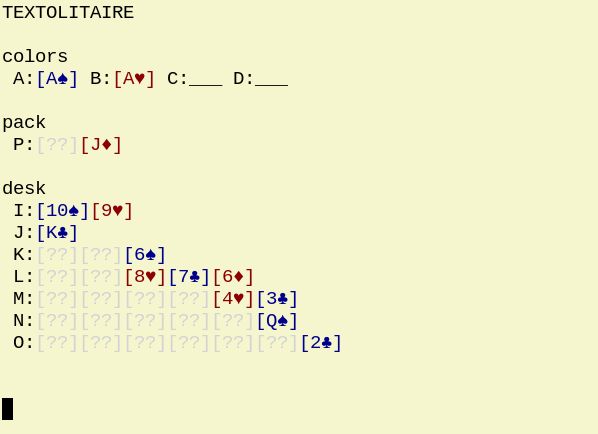
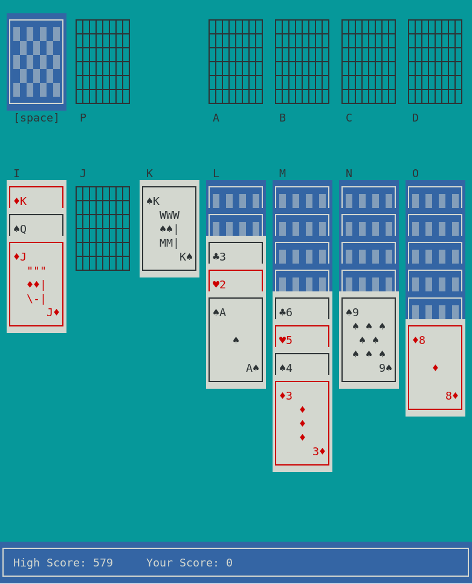

# textolitaire
Text-based Solitaire for Linux terminal




To compile and run the game, use:

```
make run
```

# textolitaire2
Curses face-lift for the same game. 



To compile and run the game, use:

```
make run2
```
