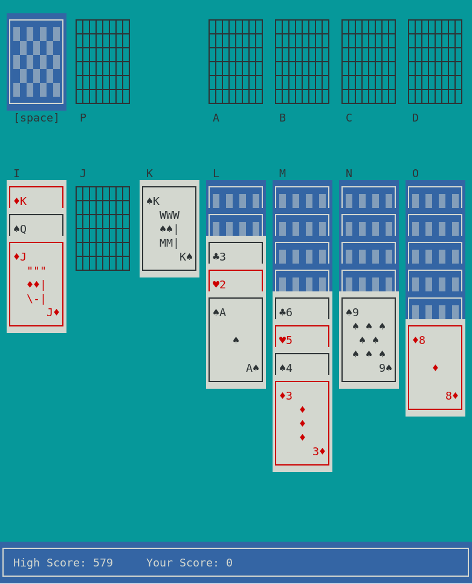

# textolitaire
Text-based Solitaire for Linux terminal


To compile and run the game, use:

```
make run
```

# textolitaire2
Curses face-lift for the same game. 



To compile fully playable demo version, use:

```
make textolitaire2
```
